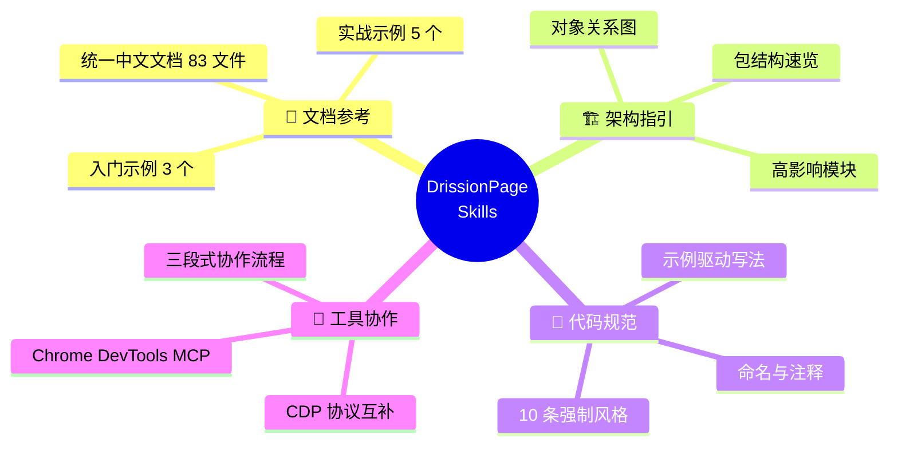
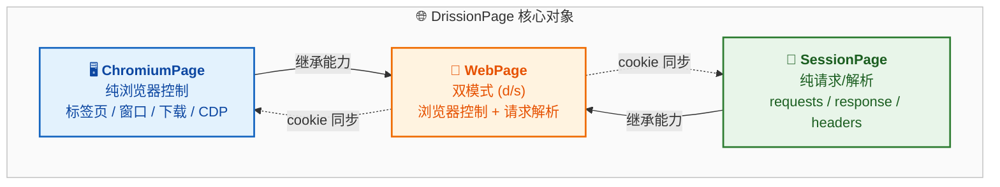
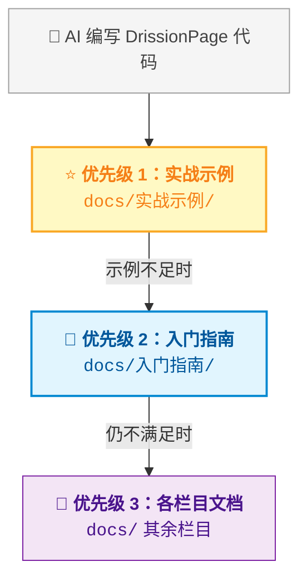
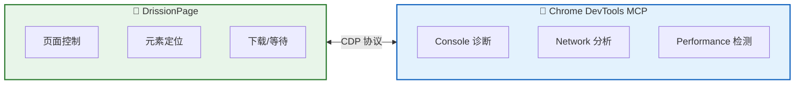

<div align="center">

# 🌐 DrissionPage Skills

[](https://agentskills.io/specification)
[](https://github.com/g1879/DrissionPage)
[](https://claude.ai)
[](https://github.com/openai/codex)

**为 AI 编程助手提供的 [DrissionPage](https://github.com/g1879/DrissionPage) 开发技能包**
帮助 AI 更准确地理解和操作 DrissionPage 源码、文档与调试任务。

*An AI Agent Skill package for [DrissionPage](https://github.com/g1879/DrissionPage) — a Python-based web automation library.*
*This skill helps AI assistants generate high-quality DrissionPage code by providing structured documentation, demos, and coding conventions.*

</div>

---

## 目录 / Table of Contents

- [项目简介](#项目简介)
- [快速开始](#快速开始)
- [目录结构](#目录结构)
- [DrissionPage 核心概念](#drissionpage-核心概念)
- [参考优先级](#参考优先级)
- [内置示例](#内置示例)
- [Chrome DevTools MCP 协作](#与-chrome-devtools-mcp-协作)
- [贡献指南](#贡献指南)
- [许可证](#许可证)

---

## 项目简介

本仓库是一个 **Copilot / AI Agent 技能（Skill）** 项目，目的是让 AI 编程助手在处理 DrissionPage 相关任务时，能够：

- 🔍 快速定位源码模块和文档位置
- 📐 遵循 DrissionPage 的分层架构和命名规范
- 💡 基于已有示例生成高质量代码
- 🔄 正确同步 API 变更涉及的所有联动文件

DrissionPage 是一个基于 Python 的网页自动化工具库，整合了数据包收发和浏览器控制两种模式，提供 `ChromiumPage`、`SessionPage` 和 `WebPage` 三种核心页面对象。

### 技能包能力总览



## 快速开始

本仓库遵循 [Agent Skills 规范](https://agentskills.io/specification)，可用于 Claude Code、Codex CLI、OpenCode 等兼容技能的 AI 编程助手。

### npx skills（推荐）

```bash
npx skills add git@github.com:fqxue/drissionpage-skills.git
```

### 手动安装

<details>
<summary><strong>Claude Code</strong></summary>

将仓库完整克隆到 Claude skills 目录（全局或项目内均可）：

```bash
git clone https://github.com/fqxue/drissionpage-skills.git ~/.claude/skills/drissionpage-skills
```

</details>

<details>
<summary><strong>Codex CLI</strong></summary>

将仓库完整克隆到 Codex skills 目录：

```bash
git clone https://github.com/fqxue/drissionpage-skills.git ~/.codex/skills/drissionpage-skills
```

</details>

<details>
<summary><strong>OpenCode</strong></summary>

将仓库完整克隆到 OpenCode skills 目录：

```bash
git clone https://github.com/fqxue/drissionpage-skills.git ~/.opencode/skills/drissionpage-skills
```

</details>

> **注意：** 请不要只复制内部 `skills/` 目录，需保留完整仓库结构，确保技能入口路径为 `.../drissionpage-skills/skills/drissionpage-dev/SKILL.md`。

### 项目内引用（可选）

如果你更习惯在项目内显式声明规则，可在 `AGENTS.md` 或 `CLAUDE.md` 中加入以下内容：

```markdown
处理 DrissionPage 相关任务时，优先参考：
1. skills/drissionpage-dev/references/docs/实战示例/
2. skills/drissionpage-dev/references/docs/入门指南/
3. skills/drissionpage-dev/references/docs/ 其余栏目
```

### 触发条件

当任务涉及以下关键词时，AI 助手应按照技能包流程工作：

| 类别 | 关键词 |
|------|--------|
| 页面对象 | `DrissionPage`、`ChromiumPage`、`SessionPage`、`WebPage` |
| 配置对象 | `ChromiumOptions`、`SessionOptions` |
| 工具与配置 | locator 语法、`dp` CLI、`dp_configs.ini`、`.pyi` 类型声明 |
| 任务类型 | 基于 DrissionPage 源码/文档实现新功能、修复行为、核对 API、补文档示例 |

### AI 工作流程概览


详细流程参见 [`SKILL.md`](skills/drissionpage-dev/SKILL.md)。

## 目录结构

```
skills/
└── drissionpage-dev/
    ├── SKILL.md                    # 技能定义文件（入口）
    ├── agents/
    │   ├── claude.md               # Claude Code 接口配置
    │   └── openai.yaml             # OpenAI Agent 接口配置
    └── references/
        ├── architecture.md         # 架构速览：包结构、核心对象、高影响模块
        ├── docs-map.md             # 文档映射与常见任务执行手册
        ├── bundled-materials.md    # 已打包到 Skill 内的资料清单
        ├── chrome-devtools-mcp.md  # Chrome DevTools MCP 协作与接入说明
        └── docs/                   # 统一中文参考文档（83 个文件）
            ├── README.md
            ├── index.json          # 文档索引（含标题、URL、字数）
            ├── 实战示例/           # ⭐ 最优先参考（6 个文件）
            ├── 入门指南/           # 安装、导入、基本概念等（10 个文件）
            ├── 控制浏览器/         # 浏览器控制、定位语法等（33 个文件）
            ├── SessionPage/        # SessionPage 相关（9 个文件）
            ├── 下载文件/           # 下载相关（4 个文件）
            ├── 进阶使用/           # 全局设置、命令行、打包等（9 个文件）
            └── 特性与示例/         # 特性介绍与对比（10 个文件）
```

## DrissionPage 核心概念



| 对象 | 职责 | 典型场景 |
|------|------|----------|
| `ChromiumPage` | 纯浏览器控制，负责标签页、窗口、下载、CDP | 自动登录、截图、缓存图片 |
| `SessionPage` | 纯请求/解析，围绕 requests、response、headers | 数据采集、API 调用 |
| `WebPage` | 双模式（d/s），继承浏览器控制和请求解析 | 需要浏览器 + 请求双模式切换 |

## 参考优先级

编写代码时，按以下优先级查阅参考资料（所有文档均为中文）：



详见 [`SKILL.md` 参考优先级](skills/drissionpage-dev/SKILL.md#参考优先级)。

## 内置示例

技能包内置了多个实战示例（位于 `references/docs/实战示例/`）：

| 示例 | 场景 | 使用对象 |
|------|------|----------|
| `🌠 豆瓣图书封面下载.md` | 浏览器缓存图片直接保存 | `ChromiumPage` |
| `🌠 Gitee 自动登录.md` | 浏览器控制自动登录 | `ChromiumPage` |
| `🌠 猫眼电影TOP100采集.md` | 浏览器翻页数据采集 | `ChromiumPage` |
| `🌠 星巴克图片下载.md` | 数据包模式图片下载 | `SessionPage` |
| `🌠 多线程多标签页采集.md` | 多线程 + 多标签页并发 | `ChromiumPage` + `get_tab()` |

更多入门示例见 `references/docs/入门指南/`（自动登录、收发数据包、模式切换）。

## 与 Chrome DevTools MCP 协作

本技能包可与 [Chrome DevTools MCP](https://github.com/ChromeDevTools/chrome-devtools-mcp) 配合使用：



详细协作流程、接入清单和交接模板见：[`chrome-devtools-mcp.md`](skills/drissionpage-dev/references/chrome-devtools-mcp.md)

## 贡献指南

欢迎提交 PR 来改进技能包，详细规范请参阅 [CONTRIBUTING.md](CONTRIBUTING.md)。

## 许可证

本项目遵循与 [DrissionPage](https://github.com/g1879/DrissionPage) 相同的使用约定。参考文档版权归 DrissionPage 原作者所有。
