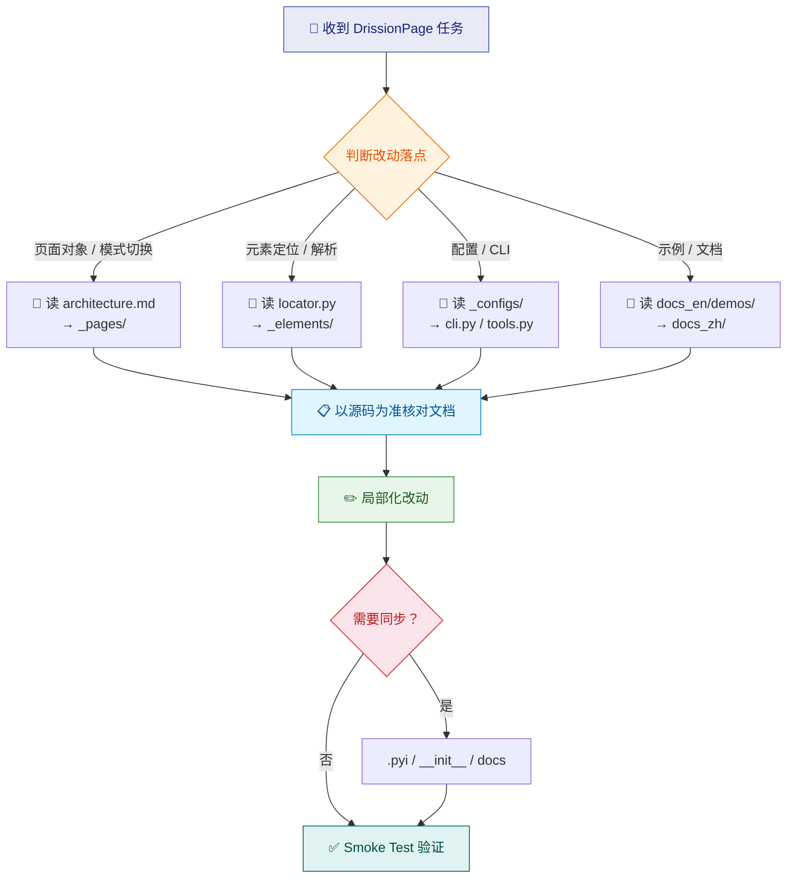

# DrissionPage Dev

## 参考优先级

编写代码时，按以下优先级查阅参考资料：

1. **示例 / Demo 优先（强制）**：先查 `references/docs_en/demos/` 和 `references/docs_en/get_start/examples/`，复用已验证的写法和调用链。**凡是编写 DrissionPage 相关代码，必须先阅读 demo 示例并严格遵循其代码风格。**
2. **中文文档其次**：示例不足时，查阅 `references/docs_zh/`（入门指南、控制浏览器、SessionPage、下载文件、进阶使用、特性与示例）获取详细说明和参数语义。
3. **英文文档补充**：中文文档未覆盖或需要对照时，再查 `references/docs_en/` 的其余文件。

## 代码风格规范（强制）

> **核心原则：凡是编写 DrissionPage 相关代码，必须参考 `references/docs_en/demos/` 和 `references/docs_en/get_start/examples/` 中的教学示例，严格遵循其代码风格。不允许自创写法或偏离 demo 已验证的模式。**

以下规则从 demo 示例中提炼，所有生成的 DrissionPage 代码必须遵守：

### 1. 导入风格

始终使用直接类导入，不使用 `import DrissionPage` 后再 `DrissionPage.ChromiumPage()` 的方式。

```python
# ✅ 正确（demo 风格）
from DrissionPage import ChromiumPage
from DrissionPage import SessionPage
from DrissionPage import WebPage

# ❌ 错误
import DrissionPage
page = DrissionPage.ChromiumPage()
```

### 2. 页面对象创建与导航

按 demo 模式：先创建页面对象，再调用 `get()` 导航。

```python
# ✅ 正确（demo 风格）
page = ChromiumPage()       # 创建页面对象
page.get('https://...')     # 访问目标网页

# ✅ SessionPage 场景
page = SessionPage()        # 创建页面对象
page.get('https://...')     # 访问目标网页

# ✅ WebPage 双模式场景
page = WebPage()            # 创建页面对象
page.get('https://...')     # 访问目标网页
```

### 3. 元素定位语法

使用 DrissionPage 的专有定位语法，不使用 CSS selector 或 XPath（除非 demo 中有对应写法）。

```python
# ✅ 正确（demo 风格）
page.ele('#user_login')             # 用 # 定位 id
page.eles('.title')                 # 用 . 定位 class
page.ele('@value=登 录')            # 用 @ 定位属性
page('t:button@tx():搜索')          # 用 t: 定位标签 + 文本匹配
page('后页>')                       # 直接用文本匹配
book('t:img')                       # 子元素中按标签定位

# ❌ 避免（非 demo 风格）
page.ele('css:input#user_login')
page.ele('xpath://input[@id="user_login"]')
```

### 4. 逐步中文注释

每个逻辑步骤前必须添加中文注释，与 demo 保持一致。

```python
# ✅ 正确（demo 风格）
# 创建页面对象
page = ChromiumPage()
# 访问目标网页
page.get('https://book.douban.com/tag/小说')
# 获取所有书籍元素
for book in page.eles('.subject-item'):
    # 获取封面图片对象
    img = book('t:img')
    # 保存图片
    img.save(r'.\imgs')
```

### 5. 链式调用

适当使用链式调用，与 demo 中的写法一致。

```python
# ✅ 正确（demo 风格）— 简单操作可链式
page.ele('#user_password').input('Your password')
page.ele('@value=登录').click()

# ✅ 正确（demo 风格）— 需要复用元素时先赋值
ele = page.ele('#user_login')
ele.input('Your account')
```

### 6. 翻页与等待模式

翻页和等待必须遵循 demo 的模式。

```python
# ✅ 正确（demo 风格）— 点击翻页后等待加载
page('后页>').click()
page.wait.load_start()

# ✅ 正确（demo 风格）— 带条件的翻页循环
btn = page('下一页', timeout=2)
if btn:
    btn.click()
    page.wait.load_start()
else:
    break
```

### 7. 对象选型

严格按任务场景选择正确的页面对象，不得混用。

| 场景 | 正确对象 | demo 参考 |
|------|----------|-----------|
| 纯浏览器控制（登录、截图、缓存图片） | `ChromiumPage` | `demos/login_gitee.md`, `demos/douban_book_pics.md`, `demos/maoyan_TOP100.md` |
| 纯请求/解析（无需浏览器） | `SessionPage` | `demos/starbucks_pics.md`, `get_start/examples/data_packets.md` |
| 需要浏览器 + 请求双模式切换 | `WebPage` | `get_start/examples/switch_mode.md` |
| 多标签页操作 | `ChromiumPage` + `get_tab()` | `demos/multithreading_with_tabs.md` |

### 8. 变量命名

遵循 demo 中的命名习惯。

- 页面对象：`page`
- 标签页对象：`tab`、`tab1`、`tab2`
- 元素对象：`ele`、`btn`、`img`、`div`、`link`、`item`
- 元素列表：`divs`、`links`、`items`
- 数据记录器：`recorder`

### 9. 函数文档字符串

使用 `:param name: description` 格式的中文文档字符串（参考 multithreading_with_tabs demo）。

```python
def collect(tab, recorder, title):
    """采集方法
    :param tab: ChromiumTab 对象
    :param recorder: Recorder 对象
    :param title: 分类标题
    :return: None
    """
```

### 10. 下载与保存

根据场景选择正确的下载方式（参考 douban_book_pics 和 starbucks_pics demo）。

```python
# ✅ 浏览器缓存图片直接保存（demo: douban_book_pics）
img.save(r'.\imgs')

# ✅ URL 资源下载（demo: starbucks_pics）
page.download(img_url, r'.\imgs', rename=name)
```

## 快速流程



1. 先判断改动落点，再读取最小必要文件。
- 页面对象与模式切换：读 `references/architecture.md`，再看 `DrissionPage/_pages/`。
- 元素定位与解析：看 `DrissionPage/_functions/locator.py`、`DrissionPage/_elements/`，必要时对照 `references/docs_zh/控制浏览器/` 和 `references/docs_en/get_elements/`。
- 浏览器启动、配置和 CLI：看 `DrissionPage/_configs/`、`DrissionPage/_functions/tools.py`、`DrissionPage/_functions/cli.py`。
- 对外行为和示例：优先读取 skill 内已复制的示例和 `references/docs_zh/`，再用 `references/docs_en/` 补充，不要依赖 skill 外部文档路径。

2. 以源码为准，用 `references/docs_zh/` 和 `references/docs_en/` 核对公开行为、参数语义和示例。

3. 公开 API 一旦变化，同步检查这些位置。
- 对应模块的 `.pyi`
- `DrissionPage/__init__.py` 和 `DrissionPage/__init__.pyi`
- 受影响的 `references/docs_zh/` 和 `references/docs_en/` 示例或说明

4. 如果用户没有特别指定参考来源，优先从 `references/docs_en/demos/` 和 `references/docs_en/get_start/examples/` 提取代码结构、对象选型和调用顺序；其次从 `references/docs_zh/` 获取详细用法和参数说明；再落到源码实现核对细节。

5. 保持改动局部化，优先延续现有分层和命名，不随意重排内部 `_` 模块职责。

## 仓库内规则

- **（强制）编写任何 DrissionPage 代码前，必须先阅读 `references/docs_en/demos/` 和 `references/docs_en/get_start/examples/` 中的 demo 示例，并严格遵循上方"代码风格规范（强制）"中提炼的所有风格要求。**
- 优先使用中文编写新增注释、说明性示例注释和打印日志；只有当周围文件明确采用英文且保持一致更重要时，才跟随英文。
- 保持 4 空格缩进、UTF-8 源文件、`PascalCase` 类名、`snake_case` 方法名。
- 不要把 `ChromiumPage`、`SessionPage`、`WebPage` 的职责混淆：
  `ChromiumPage` 只负责浏览器控制；
  `SessionPage` 只负责请求/解析；
  `WebPage` 负责 d/s 双模式与 cookie 同步。
- 生成示例代码时，默认先复用 demos 中已经验证过的写法，再按当前任务收缩或扩展，不要无依据自创新调用链。
- 处理配置或安装问题时，优先参考 `setup.py`、`requirements.txt` 和实际代码；仓库内的 `pyproject.toml` 可能只是本地工作区配置，不要直接把它当成发布事实。
- 需要与 `chrome-devtools-mcp` 协作时，优先复用 DrissionPage 的 CDP 能力（`references/docs_zh/控制浏览器/🛰️ 页面交互.md` 中 `cdp()` 方法），并说明当前步骤由 DrissionPage 还是 MCP 执行，避免职责混淆。
- 默认采用“三段式协作”：① DrissionPage 复现并最小化自动化步骤 → ② MCP 做 DevTools 诊断（Network/Performance/Console）→ ③ 回到 DrissionPage 落地修复与回归验证。
- 协作交接时至少包含：目标 URL、最小复现步骤、关键定位信息（selector/请求名）、期望与实际差异、错误文本；减少在 DrissionPage 与 MCP 之间重复试错。

## 验证方式

- 本仓库当前没有现成测试套件，优先做针对性 smoke test，而不是假设存在完整 CI。
- 常用验证命令：

```bash
python -m pip install -e .
python -m build
python -c "from DrissionPage import ChromiumPage, SessionPage, WebPage; print(WebPage)"
dp --configs-to-here
```

- 涉及浏览器行为时，补一个最小可复现场景，明确浏览器路径、端口、配置文件或本地环境前提。
- 如果源码行为与 `references/docs_zh/` 或 `references/docs_en/` 中的副本不一致，优先指出差异；若仓库内原始文档也存在，再决定是否同步修正文档。
