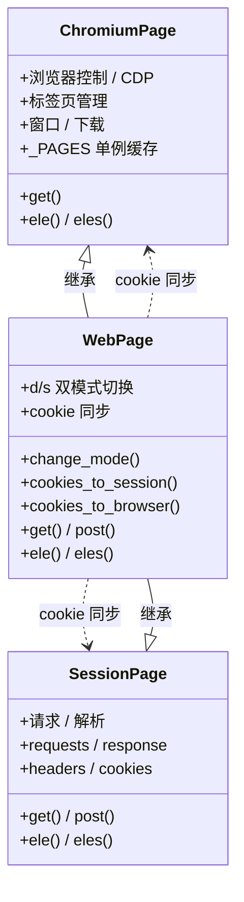
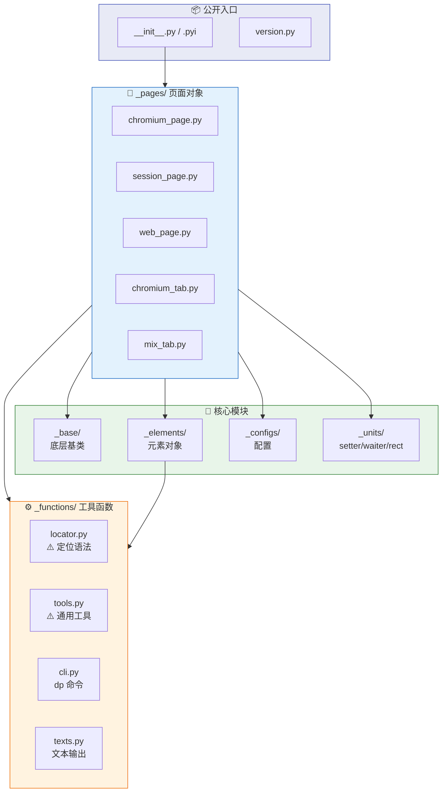

# 架构速览

## 总览

```
DrissionPage/
├── __init__.py / .pyi    ← 公开入口
├── version.py            ← 版本号
├── _base/                ← 底层基类和连接能力
├── _pages/               ← 页面对象主实现
│   ├── chromium_page.py  ← ChromiumPage（浏览器控制）
│   ├── session_page.py   ← SessionPage（请求/解析）
│   ├── web_page.py       ← WebPage（双模式）
│   ├── chromium_tab.py   ← 标签页对象
│   └── mix_tab.py        ← 混合标签页对象
├── _elements/            ← 元素对象
├── _configs/             ← 配置（Options / ini）
├── _functions/           ← 工具函数
│   ├── locator.py        ← ⚠️ 定位语法转换中心
│   ├── tools.py          ← ⚠️ 通用工具
│   ├── cli.py            ← dp 命令入口
│   └── texts.py          ← 文本/语言输出
└── _units/               ← 配套能力（setter/waiter/rect）
```

## 三大 Page 对象关系



- **`ChromiumPage`**：纯浏览器控制对象；负责标签页、窗口、下载、CDP 相关能力。实现里有 `_PAGES` 单例缓存，修改构造逻辑时要谨慎。
- **`SessionPage`**：纯请求/解析对象；围绕 requests、response、headers、session element 工作。
- **`WebPage`**：同时继承 `SessionPage` 和 `ChromiumPage`，核心价值是 d/s 双模式切换与 cookie 同步。改这里时优先检查：
  - `change_mode()`
  - `cookies_to_session()`
  - `cookies_to_browser()`
  - `get()/post()/ele()/eles()`

## 公开入口

| 文件 | 说明 |
|------|------|
| `DrissionPage/__init__.py` | 暴露 `Chromium`, `ChromiumPage`, `SessionPage`, `WebPage`, `ChromiumOptions`, `SessionOptions` |
| `DrissionPage/__init__.pyi` | 公开类型声明；公开签名变更时要同步 |
| `DrissionPage/version.py` | 版本号来源 |
| `setup.py` | 发布入口，包含依赖和 `dp` 命令行入口 |

## 高影响模块

| 模块 | 说明 | 影响范围 |
|------|------|----------|
| `_functions/locator.py` | 定位语法转换中心 | 大量页面对象和文档示例 |
| `_functions/tools.py` | 端口寻找、配置复制、错误转换 | `configs_to_here()` 生成 `dp_configs.ini` |
| `_functions/cli.py` | `dp` 命令入口 | 浏览器路径、用户目录、配置文件 |
| `_functions/texts.py` | 文本与语言输出 | 报错文本、提示信息 |

## 模块依赖关系



## 改动检查清单

1. 是否影响公开导入路径或构造参数。
2. 是否需要同步 `.pyi`。
3. 是否影响 `references/docs/` 中的示例或参数说明。
4. 是否破坏 `WebPage` 的模式语义或 cookie 同步。
5. 是否影响 `dp` CLI 或 `dp_configs.ini` 生成流程。
